# 传递函数与裂变矩阵算法流程图

## 1. 总体流程概览

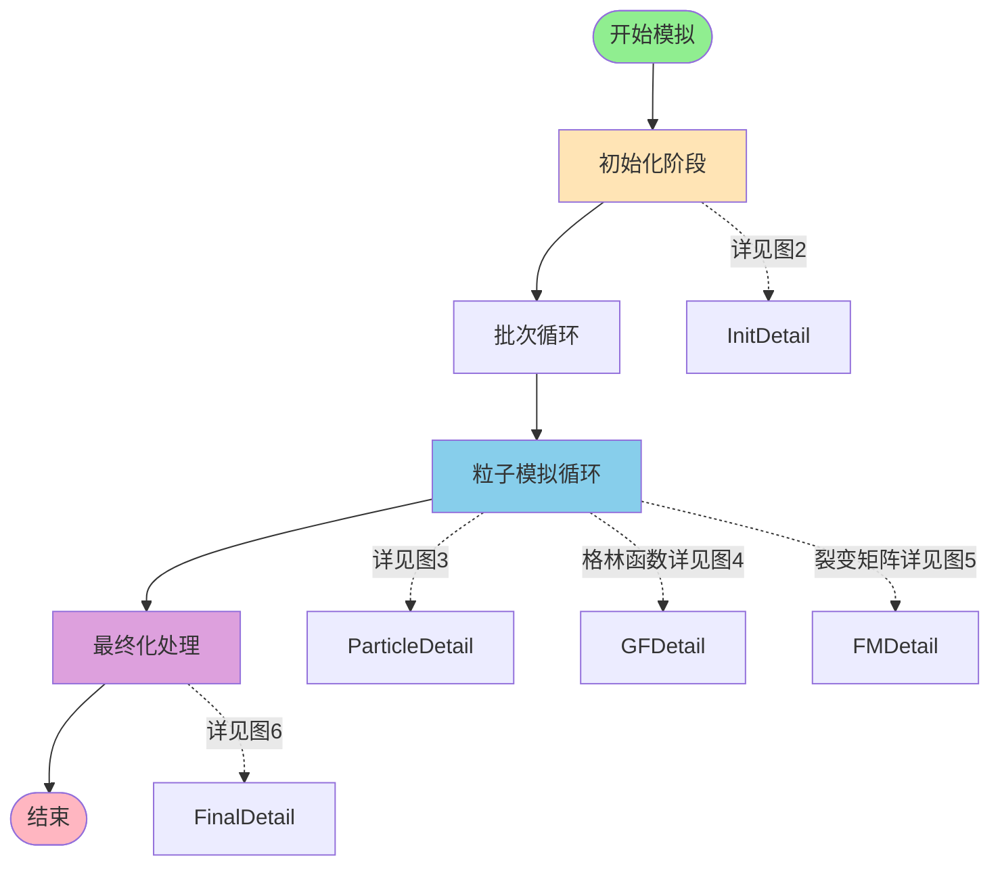

---

## 2. 初始化阶段详细流程

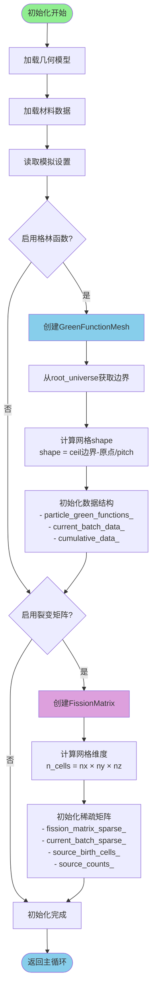

---

## 3. 单粒子输运主循环

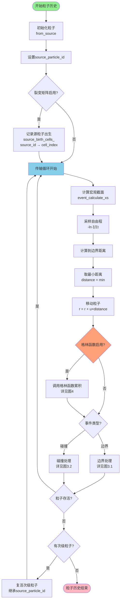

### 3.1 边界处理子流程

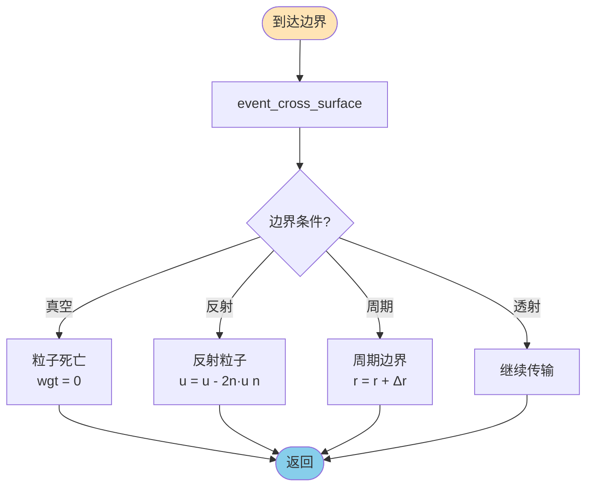

### 3.2 碰撞处理子流程

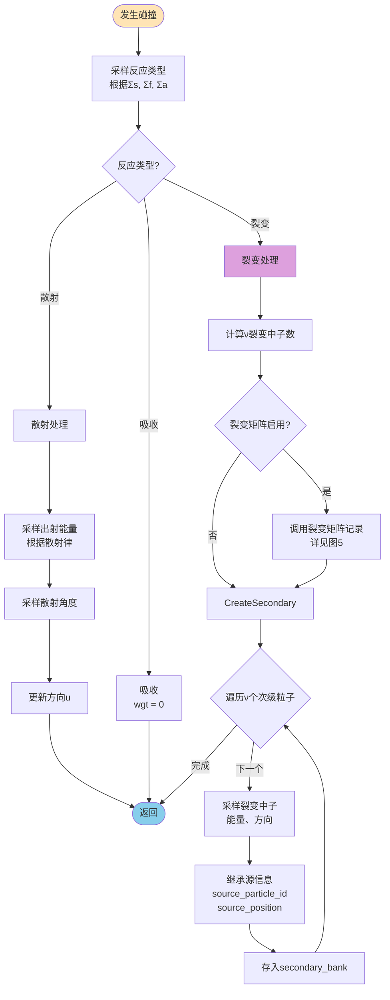

---

## 4. 格林函数累积详细流程

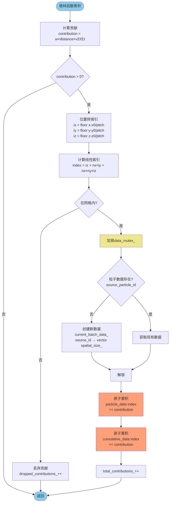

---

## 5. 裂变矩阵记录详细流程

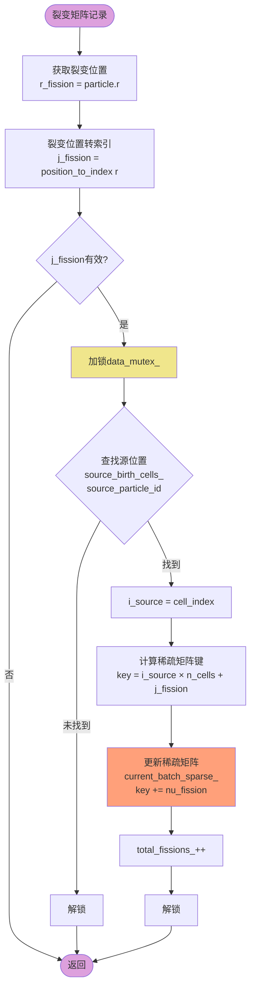

---

## 6. 最终化处理详细流程

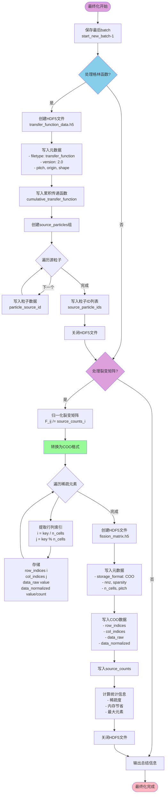

---

## 7. 批次管理流程

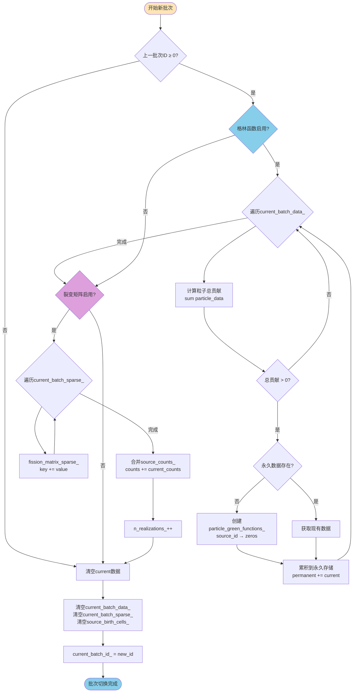

---

## 8. 数据结构关系图

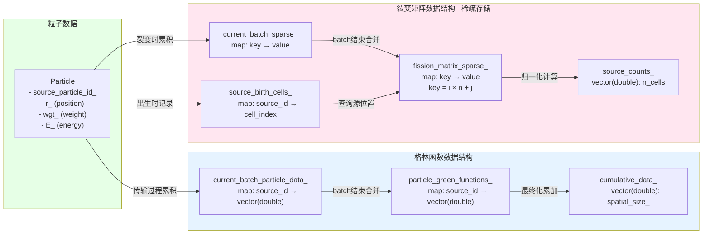

---

## 9. 时序图：单粒子历史的格林函数与裂变矩阵交互

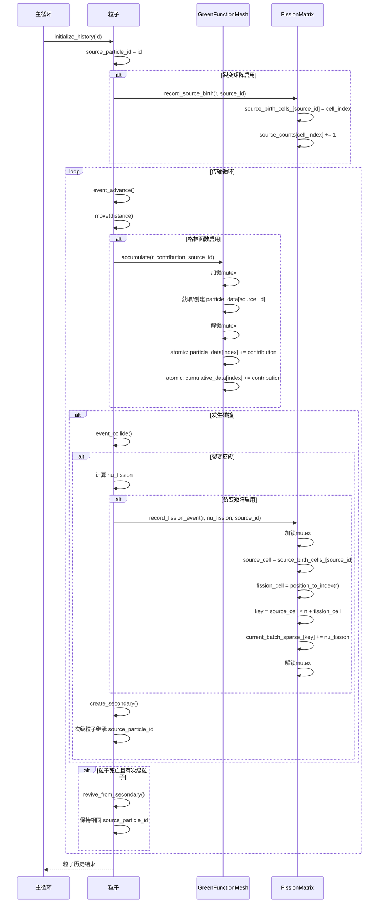

---

## 10. 数据处理流程总览

```mermaid
flowchart TB
    subgraph Input["输入阶段"]
        I1[源粒子参数
        位置、能量、方向]
        I2[几何模型
        材料、边界]
        I3[网格参数
        分辨率、边界]
    end
    
    subgraph Processing["粒子模拟阶段"]
        P1[粒子传输
        位置变化]
        P2[碰撞处理
        反应采样]
        P3[次级粒子
        产生与追踪]
        
        P1 --> P2
        P2 --> P3
        P3 --> P1
    end
    
    subgraph Accumulation["累积阶段"]
        A1[格林函数累积
        T(source_id, r)]
        A2[裂变矩阵累积
        F(i, j)]
        A3[批次管理
        batch统计]
        
        A1 --> A3
        A2 --> A3
    end
    
    subgraph Output["输出阶段"]
        O1[归一化处理
        按源粒子数/批次数]
        O2[格式转换
        COO稀疏格式]
        O3[HDF5文件输出
        可视化数据]
    end
    
    I1 --> Processing
    I2 --> Processing
    I3 --> Accumulation
    
    Processing -->|位置+权重+νΣf| A1
    Processing -->|源位置+裂变位置| A2
    
    Accumulation --> O1
    O1 --> O2
    O2 --> O3
    
    style Input fill:#E6F3FF
    style Processing fill:#FFF4E6
    style Accumulation fill:#E6FFE6
    style Output fill:#FFE6F0
```

---

## 附录：核心算法伪代码

### A1. 格林函数累积

```python
function accumulate_green_function(particle):
    """
    在每次粒子推进时调用
    计算传递函数 T(P0 -> r) = ∫∫ ν̄Σf Φ dΩdE
    """
    # 计算贡献：w × distance × (ν̄Σf / Σt)
    contribution = particle.weight × distance × (nu_sigma_f / sigma_t)
    
    if contribution <= 0:
        return
    
    # 位置转换为网格索引
    cell_index = position_to_index(particle.position)
    
    if cell_index < 0:  # 超出边界
        dropped_contributions++
        return
    
    # 线程安全地获取或创建粒子数据
    with mutex_lock:
        if particle.source_id not in current_batch_data:
            current_batch_data[particle.source_id] = zeros(spatial_size)
    
    # 原子操作累积
    atomic_add(current_batch_data[particle.source_id][cell_index], contribution)
    atomic_add(cumulative_data[cell_index], contribution)
    total_contributions++
```

### A2. 裂变矩阵记录

```python
function record_source_birth(particle):
    """粒子初始化时记录源位置"""
    source_cell = position_to_index(particle.birth_position)
    
    with mutex_lock:
        source_birth_cells[particle.source_id] = source_cell
        source_counts[source_cell] += 1
        total_sources++

function record_fission_event(particle):
    """裂变事件时记录"""
    # 查找源位置
    with mutex_lock:
        if particle.source_id not in source_birth_cells:
            return
        source_cell = source_birth_cells[particle.source_id]
    
    # 计算裂变位置
    fission_cell = position_to_index(particle.position)
    if fission_cell < 0:
        return
    
    # 计算裂变产生中子数
    nu_fission = calculate_nu_fission(particle)
    
    # 累积到稀疏裂变矩阵
    key = source_cell × n_cells + fission_cell
    
    with mutex_lock:
        current_batch_sparse[key] += nu_fission
        total_fissions++
```

### A3. 批次管理

```python
function start_new_batch(batch_id):
    """批次切换时合并数据"""
    if current_batch_id >= 0:
        # 格林函数：保存上一个batch的数据
        for source_id, data in current_batch_data:
            if sum(data) > 0:
                if source_id not in particle_green_functions:
                    particle_green_functions[source_id] = zeros(spatial_size)
                # 累积到永久存储
                particle_green_functions[source_id] += data
        
        # 裂变矩阵：合并稀疏数据
        for key, value in current_batch_sparse:
            fission_matrix_sparse[key] += value
        
        for i in range(n_cells):
            source_counts[i] += current_batch_source_counts[i]
        
        n_realizations++
    
    # 清空当前batch数据
    current_batch_data.clear()
    current_batch_sparse.clear()
    source_birth_cells.clear()
    current_batch_source_counts.fill(0)
    
    current_batch_id = batch_id
```

### A4. COO格式转换

```python
function convert_to_COO(fission_matrix_sparse):
    """
    将稀疏矩阵转换为COO (Coordinate) 格式
    COO格式: (row_indices[], col_indices[], data[])
    """
    nnz = len(fission_matrix_sparse)
    
    row_indices = zeros(nnz, int)
    col_indices = zeros(nnz, int)
    data_raw = zeros(nnz, double)
    data_normalized = zeros(nnz, double)
    
    index = 0
    for key, value in fission_matrix_sparse:
        # 从线性键恢复(i,j)索引
        i = key // n_cells  # 行索引（源单元）
        j = key % n_cells   # 列索引（裂变单元）
        
        row_indices[index] = i
        col_indices[index] = j
        data_raw[index] = value
        
        # 归一化：F_norm[i][j] = F_raw[i][j] / source_counts[i]
        if source_counts[i] > 0:
            data_normalized[index] = value / source_counts[i]
        else:
            data_normalized[index] = 0
        
        index++
    
    return (row_indices, col_indices, data_raw, data_normalized)
```

---

## 流程图使用说明

### 图表导航

1. **图1 - 总体流程概览**: 从这里开始，了解整体架构
2. **图2 - 初始化阶段**: 详细了解网格和数据结构的创建
3. **图3 - 单粒子输运**: 核心模拟循环，包含边界和碰撞处理子流程
4. **图4 - 格林函数累积**: 传递函数的详细计算过程
5. **图5 - 裂变矩阵记录**: 稀疏矩阵的填充过程
6. **图6 - 最终化处理**: HDF5输出和归一化
7. **图7 - 批次管理**: 数据在批次间的合并机制
8. **图8 - 数据结构关系**: 理解各数据结构之间的关系
9. **图9 - 时序图**: 查看粒子与两个功能模块的交互时序
10. **图10 - 数据处理总览**: 从输入到输出的数据流

### 颜色编码

- 🟢 **绿色**: 开始节点
- 🔵 **蓝色**: 格林函数相关操作
- 🟣 **紫色**: 裂变矩阵相关操作
- 🟠 **橙色**: 原子操作/线程安全操作
- 🟡 **黄色**: 互斥锁操作
- 🩷 **粉色**: 结束节点

### 关键概念

- **source_particle_id**: 源粒子唯一标识，次级粒子继承该ID
- **稀疏矩阵**: 使用 `key = i × n + j` 的线性索引存储
- **COO格式**: 三数组存储 (row[], col[], data[])
- **原子操作**: 保证多线程安全的累积操作
- **批次管理**: 定期合并临时数据到永久存储

---

**文档版本**: v1.0  
**创建日期**: 2025年11月3日  
**适用于**: OpenMC传递函数与裂变矩阵功能
